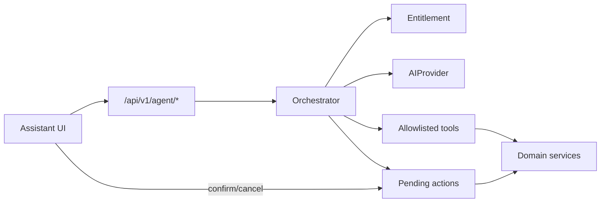

# Assistente IA do Croniu — V1

## Objetivo

Chat textual com consultas reais e ações com confirmação explícita. Sem voz, sem WhatsApp API, sem execução silenciosa.

## Arquitetura



- Tenant: `organization_id` só da sessão.
- Provider: `OpenAIResponsesProvider` (`/v1/responses`, `store=false`) ou `fake` / `openai_compatible`.
- Histórico canônico no Postgres (`agent_threads` / `agent_messages` / `agent_runs`).

## Confirmação

| Classe | Exemplos | UI |
|--------|----------|-----|
| read | get_today_summary, search_clients | Resposta direta |
| write_common | create_client, create_appointment, evaluation | Cartão Confirmar/Cancelar |
| write_sensitive | payment, cycle, reschedule, outcome | Cartão reforçado |
| forbidden V1 | exclusão, billing admin | Não exposto |

## Config HML

```env
AI_ENABLED=true   # ou false se sem chave
LLM_PROVIDER=openai_responses
OPENAI_API_KEY=   # só no .env.hml
OPENAI_MODEL=gpt-5.6-terra
AI_STORE_RESPONSES=false
AI_USER_REQUESTS_PER_MINUTE=6
AI_ORG_DAILY_REQUEST_LIMIT=200
AI_CONFIRMATION_TTL_SECONDS=600
```

Kill switch: `AI_ENABLED=false`.

## Migration

`0013_agent_assistant_v1` — após `0012_billing_asaas`.

## Admin

`GET /api/v1/platform/ai-ops` + página `/ai` — métricas sem conversas nem chave.

## Catálogo de ferramentas (V1)

### Leitura

| Tool | Domínio |
|------|---------|
| `get_today_summary` | Home/Hoje canônico |
| `list_upcoming_appointments` | Agenda |
| `search_clients` | Clientes |
| `get_client_overview` | Clientes |
| `list_cycles_needing_attention` | Ciclos |
| `get_cycle_details` | Ciclos |
| `list_pending_receivables` | Financeiro |
| `get_payment_status` | Financeiro |
| `list_renewal_requests` | Renovações |
| `list_client_evaluations` | Avaliações |
| `list_client_milestones` | Marcos (via avaliações) |

### Escrita (proposta → confirmação)

| Tool | Risco |
|------|-------|
| `propose_create_client` | write_common |
| `propose_create_appointment` | write_common |
| `propose_create_evaluation` | write_common |
| `propose_add_milestone` | write_common |
| `propose_reschedule_appointment` | write_sensitive |
| `propose_create_cycle` | write_sensitive |
| `propose_record_payment` | write_sensitive |
| `propose_mark_appointment_outcome` | write_sensitive |

Nenhuma tool aceita `organization_id` do modelo.

## Runbook

Ver `docs/AI_ASSISTANT_RUNBOOK.md`.

## Voz / notificações (fora do V1)

Arquitetura permite fila futura; V1 interativa não usa Redis/Celery (ADR-042).

## Rollback

1. `AI_ENABLED=false` e recreate `croniu-hml-api`
2. Ou imagens anteriores de api/web/admin
3. Migration downgrade só se necessário e com backup
