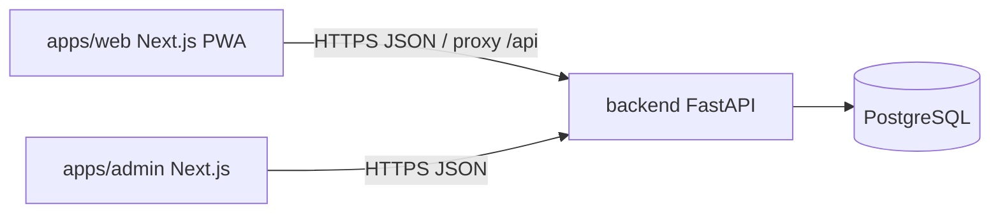

# Croniu — Arquitetura

**Estado real auditado:** Sprint 2A.1. Hostnames abaixo são **planejamento**, não confirmação de DNS.

## Visão geral



- **apps/web:** profissionais (mobile-first PWA).  
- **apps/admin:** plataforma NTWS Labs (desktop-first, deploy separado).  
- **Backend único:** regras de domínio; rotas `/api/v1/platform/*` com `platform_membership`.  
- **Não** duplicar regras de negócio no Next.js.

## Monorepositório

```
croniu/
├── apps/web/
├── apps/admin/
├── backend/
├── packages/brand/
├── docs/
├── deploy/hml/          # artefatos; não implantados nesta linha
├── compose.yaml
├── AGENTS.md
└── README.md
```

Independente de Kyvora / outros produtos NTWS Labs.

## Stack

| Camada | Tecnologia |
|--------|------------|
| Web / Admin | Next.js 16, React 19, TypeScript, Tailwind 4 |
| API | Python ≥3.12, FastAPI, SQLAlchemy 2, Alembic, Pydantic |
| DB | PostgreSQL 16 |
| Auth | Cookie sessão + Argon2id (`pwdlib`) |
| Local | Docker Compose (`compose.yaml`) |
| Testes | pytest · Vitest · Playwright |

## Limites frontend ↔ backend

| Frontend | Backend |
|----------|---------|
| UI, formulários, navegação, PWA | Validação de domínio, tenant, persistência |
| Proxy same-origin `/api` (recomendado mobile) | CORS configurável se origens distintas |
| Sem `organization_id` como fonte de verdade | Sessão resolve org |

## Autenticação

- Cookie `croniu_session` (org) e `croniu_admin_session` (plataforma) — **separados**.  
- HttpOnly; `Secure` em HTTPS; `SameSite=Lax` (ajustar se cross-site).  
- Sem tokens sensíveis em `localStorage`.  
- Detalhes: [`SECURITY.md`](./SECURITY.md), ADR-004 em [`DECISIONS.md`](./DECISIONS.md).

## Multi-tenancy

Toda entidade de negócio com `organization_id`; filtro no serviço; testes de isolamento.

## PWA

Manifest + service worker básicos em `apps/web`. Offline rico: evolução.

## Docker / local

Compose sobe Postgres; API e Next tipicamente no host. Portas: ver [`PROJECT_STATE.md`](./PROJECT_STATE.md).

## Hostnames (planejamento apenas)

| Host | Uso pretendido |
|------|----------------|
| `croniu.com.br` | Site / marketing |
| `app.croniu.com.br` | App profissionais |
| `api.croniu.com.br` | API |
| `admin.croniu.com.br` | Admin plataforma |

**Não afirmar** registro, DNS, Tunnel ou certificados. Domínio ainda `PENDENTE_DE_DECISAO`.

## HML / produção

Artefatos em `deploy/hml/`. Jarvis **não** acessado nesta sprint documental. Produção inexistente.

## Limitações conscientes

Sem filas, cache distribuído, WhatsApp API, Google Calendar, OpenAPI restrita em HML conforme config futura.
