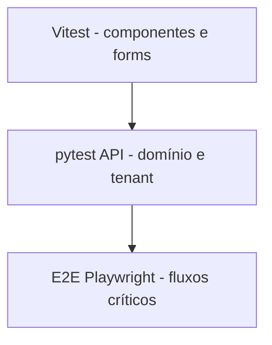

# Croniu — Estratégia de testes

Alinhada ao código pós-Sprint 2C. Matriz: [`PRODUCT_SPEC.md`](./PRODUCT_SPEC.md) §9.

## Pirâmide

1. **Unitário/UI** — Vitest + Testing Library (web/admin)  
2. **API/integração** — pytest (auth, platform, domínio 2A + agenda 2B)  
3. **E2E** — Playwright (auth + Sprint 2A + Sprint 2B)  
4. **Visual/manual** — artefatos + homologação de identidade  
5. **HML smokes** — quando HML existir e for autorizada  

## Backend (pytest)

Arquivos: `test_auth.py`, `test_platform.py`, `test_domain_sprint2a.py`, `test_agenda_sprint2b.py`, `test_cycle_calc.py`, `test_cycle_intelligence_sprint2c.py`.

| Área | Regras cobertas (exemplos) |
|------|----------------------------|
| Auth | register, login, logout, me, sessão inválida, e-mail duplicado |
| Platform | anônimo/org owner negados; admin overview; mascaramento; elevação recusada; auditoria login |
| Domínio 2A | clientes/serviços/ciclos/recebíveis; isolamento; mark-paid; WhatsApp prep; home summary |
| Agenda 2B | timezone válido/inválido; locais CRUD/arquivo; compromissos; conflito half-open; consecutivos OK; isolamento; agenda do dia |

Mapear sempre aos IDs `FR-*` / `NFR-*`.

## Frontend web (Vitest)

Componentes, formulários auth, empty states, nav 5 itens, a11y básica.

## Frontend admin (Vitest)

Login / acesso negado.

## E2E

- Fundação: cadastro → painel; logout; anônimo bloqueado  
- Sprint 2A: fluxo domínio + artefatos em `apps/web/e2e/artifacts/sprint2a/`  
- Sprint 2C: serviço → modelo → ciclo inteligente + desconto (`e2e/sprint2c.spec.ts`)  
- Admin E2E: especificado; executar quando ambiente disponível  

## Multi-tenancy

Obrigatório em toda sprint que toque dados de negócio (locais e compromissos inclusos).

## Migrations

Validar head Alembic (`0005_sprint2b_agenda`) nos gates; testes usam DB de teste conforme `conftest`.

## Visual / acessibilidade / PWA

- Visual: screenshots E2E + homologação manual do wordmark  
- A11y: checks básicos; auditoria profunda futura  
- PWA: manifest nos E2E; offline rico futuro  

## Integração futura / HML

Google Calendar, Meu Ciclo, smokes HML — só após sprint autorizada e ambiente.

## O que não testar agora

UI cosmético 100%; carga; módulos ainda `PLANEJADO` (GCal, recorrência, Meu Ciclo); mutações admin de agenda bloqueadas.
